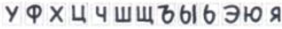

# Курсовой проект // Овсянников, Макаренко, Бедловский   

## Описание 
Программа реализующая преобразование русского текста с изображения в текстовый формат.
## Уточнения по форматированию текста 
Русский алфавит, верхний регистр, печатный формат. Знаки препинания включаются в распознование.  
## Задачи участников

| Алексей Бедловский | разработка датасета, разработка утилиты разбиения текста на буквы | 
| Александр Макаренко | разработка утилиты разбиения текста на буквы | 
| Никита Овсянников | разработка модели нейронной сети для классификации буквы, помощь в разработке утилиты |
## Пример распознаваемого текста

## План задачи 

1. Собрать датасет для обучения НС.
2. Разработать алгоритм разбиения текста на отдельные буквы. 
3. Разработать алгоритм преобразования изображения в удобный формат входа в НС.
4. Разработать и обучить НС для классиифкации.
